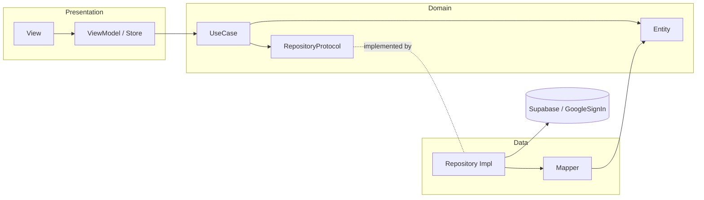

# System Architecture

## Overview

The `saa` iOS app uses a feature-sliced **Pragmatic 3-layer Clean Architecture** (Presentation / Domain / Data). Each feature owns its own vertical slice; cross-cutting infrastructure lives in `Core/`; reusable presentation pieces live in `Shared/`.

Sealed architectural decision: [`plans/reports/brainstorm-260612-1012-clean-architecture-refactor.md`](../plans/reports/brainstorm-260612-1012-clean-architecture-refactor.md)
Refactor plan that landed this layout: [`plans/260612-1012-clean-architecture-refactor/plan.md`](../plans/260612-1012-clean-architecture-refactor/plan.md)

## Layer rules

1. **Dependency direction is one-way.** `Presentation → Domain ← Data`. Presentation never imports Data directly; Data depends on Domain protocols, never the reverse.
2. **Domain imports only `Foundation`.** Two documented exceptions, both because the GIDSignIn API requires a `UIViewController` presenter:
   - `Features/Authentication/Domain/GoogleSignInServiceProtocol.swift` — imports `UIKit` (the presenter parameter type)
   - `Features/Authentication/Domain/UseCases/SignInWithGoogleUseCase.swift` — imports `UIKit` (forwards the presenter through the protocol seam)
3. **Composition root.** `App/saaApp.swift` is the only place that wires the dependency graph. Manual DI; if the file exceeds 80 LOC, helpers move into feature-specific extension files (`saaApp+KudosSetup.swift`, `saaApp+HomeSetup.swift`, etc.), each ≤ 80 LOC.
4. **Stores are singletons in scope, not in code.** `AuthSessionStore` is constructed in `saaApp.swift` and injected via `@EnvironmentObject`. No `static shared` on the store.
5. **No SDK type leakage into views.** Mapping from `Supabase.Session` to `UserSession` happens in `Data/UserSessionMapper.swift`. Mapping from arbitrary `Error` to the `AuthError` domain enum happens in `Data/AuthErrorMapper.swift`. The Domain enum is pure-Swift.

## Folder layout

```
saa/
├── App/
│   ├── saaApp.swift                       # composition root (≤ 80 LOC)
│   ├── saaApp+Setup.swift                 # Google config + DEBUG UI-test seam
│   ├── saaApp+HomeSetup.swift             # Home dependency wiring
│   └── saaApp+KudosSetup.swift            # Kudos dependency wiring
├── Core/
│   ├── Configuration/Environment.swift
│   ├── Localization/{AppLanguage,LanguagePreference}.swift
│   ├── Networking/SupabaseClientProvider.swift
│   └── Session/AuthSessionStore.swift     # session SoT + isAccessDenied flag, @EnvironmentObject
├── Features/
│   ├── Authentication/
│   │   ├── Domain/
│   │   │   ├── UserSession.swift          # entity
│   │   │   ├── AuthRepositoryProtocol.swift
│   │   │   ├── GoogleSignInServiceProtocol.swift
│   │   │   ├── AuthError.swift            # pure enum
│   │   │   ├── Nonce.swift                # + NonceGenerating protocol
│   │   │   └── UseCases/
│   │   │       ├── SignInWithGoogleUseCase.swift
│   │   │       ├── RestoreSessionUseCase.swift
│   │   │       └── SignOutUseCase.swift   # + AuthSessionClearable seam
│   │   ├── Data/
│   │   │   ├── SupabaseAuthRepository.swift
│   │   │   ├── GoogleSignInService.swift
│   │   │   ├── UserSessionMapper.swift
│   │   │   ├── AuthErrorMapper.swift      # SDK Error → AuthError
│   │   │   ├── NoopAuthRepository.swift   # DEBUG-only UI-test fake
│   │   │   └── NoopGoogleSignInService.swift  # DEBUG-only UI-test fake
│   │   └── Presentation/
│   │       ├── AppRouter.swift            # spinner / accessDenied / home / login switch
│   │       ├── LoginViewContainer.swift
│   │       ├── LoginView.swift
│   │       └── LoginViewModel.swift
│   └── Home/
│       ├── Domain/
│       │   ├── Award.swift                # entity
│       │   ├── AwardsRepositoryProtocol.swift
│       │   └── AwardsError.swift          # pure enum
│       ├── Data/
│       │   ├── SupabaseAwardsRepository.swift
│       │   ├── AwardMapper.swift
│       │   └── AwardsErrorMapper.swift
│       └── Presentation/
│           ├── MainTabView.swift          # signed-in root; HomeViewContainer on tab 0
│           ├── HomeViewContainer.swift
│           ├── HomeView.swift
│           ├── HomeViewModel.swift
│           ├── HomeAwardsSection.swift
│           ├── HomeKudosSection.swift     # feature-flagged via FeatureFlags.isKudosAvailable
│           ├── AccessDeniedView.swift
│           ├── AwardsState.swift
│           ├── FeatureFlags.swift         # compile-time flags; migrate to remote config when needed
│           ├── Countdown.swift
│           ├── HomeMockData.swift         # preview fixtures (awards + other sections)
│           └── Stubs/                     # placeholder screens for future tabs
│   └── Kudos/
│       ├── Domain/
│       │   ├── Kudos.swift                # entity
│       │   ├── Department.swift           # entity
│       │   ├── EventBonus.swift           # entity
│       │   ├── Hashtag.swift              # entity
│       │   ├── KudosFilter.swift          # value type
│       │   ├── StarTier.swift             # enum
│       │   ├── UserStats.swift            # entity
│       │   ├── CreateKudoRequest.swift    # value type (feature/create-kudos)
│       │   ├── CreateKudoValidator.swift  # pure validator (feature/create-kudos)
│       │   ├── CreateKudoFieldError.swift # validation error enum (feature/create-kudos)
│       │   ├── KudosAttachment.swift      # entity (feature/create-kudos)
│       │   ├── KudosImageDraft.swift      # value type (feature/create-kudos)
│       │   ├── KudosImageUploaderProtocol.swift  # protocol (feature/create-kudos)
│       │   ├── KudosRepositoryProtocol.swift
│       │   ├── KudosError.swift           # pure enum
│       │   └── UseCases/
│       │       ├── LoadKudosScreenUseCase.swift
│       │       └── ToggleKudosReactionUseCase.swift
│       ├── Data/
│       │   ├── DTO/                       # Supabase codable DTOs (incl. CreateKudo* DTOs)
│       │   ├── SupabaseKudosRepository.swift  # createKudo added (feature/create-kudos)
│       │   ├── SupabaseStorageImageUploader.swift  # (feature/create-kudos)
│       │   ├── KudosImageResizer.swift    # (feature/create-kudos)
│       │   ├── CreateKudoMapper.swift     # (feature/create-kudos)
│       │   ├── KudosMapper.swift
│       │   ├── DepartmentMapper.swift
│       │   ├── HashtagMapper.swift
│       │   ├── EventBonusMapper.swift
│       │   ├── UserStatsMapper.swift
│       │   └── KudosErrorMapper.swift
│       └── Presentation/
│           ├── KudosViewContainer.swift   # NavigationStack root on MainTabView tab 1; Route enum (case all)
│           ├── KudosView.swift
│           ├── KudosViewModel.swift       # @MainActor ObservableObject; AllFeedLoadState enum; repository dependency added
│           ├── KudosViewModel+Likes.swift # reaction toggle; propagates into feed, highlights, allFeed
│           ├── KudosViewModel+AllFeed.swift  # paginated all-feed extension (feature/all-kudos)
│           ├── AllKudos/                  # full-page All Kudos screen (feature/all-kudos)
│           │   ├── AllKudosViewContainer.swift
│           │   ├── AllKudosView.swift
│           │   ├── AllKudosFeedList.swift
│           │   └── KudosCardAdapter.swift # shared card-mapping helper (DRY; replaces inline static in KudosViewContainer)
│           ├── Components/               # KudosCard, filter chips, carousel dots
│           ├── Create/                   # compose flow (feature/create-kudos)
│           │   ├── CreateKudoViewContainer.swift
│           │   ├── CreateKudoView.swift
│           │   ├── CreateKudoViewModel.swift
│           │   ├── CreateKudoComposer.swift
│           │   ├── RecipientDropdown.swift / HashtagDropdown.swift
│           │   ├── CreateKudoImageField.swift / MarkdownToolbar.swift
│           │   └── CreateKudoAnonymousToggle.swift / CreateKudoActionBar.swift
│           ├── Filters/                  # department + hashtag filter sheets
│           └── Sections/                 # Hero, Highlight, All, Stats, etc.
└── Shared/
    ├── Components/{CountryFlag,LanguagePicker}.swift
    └── Extensions/UIApplication+TopViewController.swift
```

Tests:

```
saaTests/
├── Doubles/                               # protocol-driven fakes
│   ├── AuthRepositoryFake.swift
│   ├── AwardsRepositoryFake.swift
│   ├── GoogleSignInServiceFake.swift
│   ├── KudosClipboardServiceFake.swift    # added for Kudos feature
│   ├── KudosRepositoryFake.swift          # added for Kudos feature
│   └── NonceGeneratorFake.swift
├── Domain/
│   └── SignInWithGoogleUseCaseTests.swift # no SDK, no network
├── Features/
│   ├── Home/Presentation/
│   │   └── LocalizationKeysExistTests.swift
│   └── Kudos/
│       ├── Domain/                        # Kudos domain unit tests
│       ├── Data/                          # Kudos data layer tests
│       └── Presentation/                  # KudosViewModel tests
├── Presentation/
│   ├── AuthSessionStoreTests.swift
│   ├── HomeViewModelTests.swift
│   └── LoginViewModelTests.swift
├── AppRouterRoutingTests.swift
├── AuthErrorMappingTests.swift
├── AwardsErrorMappingTests.swift
├── CountdownTests.swift
├── LoginViewContainerPropsTests.swift
├── NonceTests.swift
└── TestSupport/StubSupabaseClient.swift
saaUITests/
├── LoginFlowUITests.swift
├── CreateKudoUITests.swift                # TC_WRITE_FUN_001 + TC_WRITE_FUN_002 (feature/create-kudos)
├── KudosTabUITests.swift
├── HomeIntegrationUITests.swift
├── saaUITests.swift
└── TestSupport/UITestHelpers.swift
                                           # Total: 384 passing (feature/all-kudos)
```

## Dependency diagram



The dashed arrow from `RepositoryProtocol` to `Repository Impl` is dependency-inversion: Domain defines the contract; Data implements it; Presentation depends on the contract, never on the implementation.

## Database schema

All tables live in the Supabase `public` schema. RLS is enabled on every table. Migrations are in `supabase/migrations/`.

| Table | Introduced | Notes |
|-------|-----------|-------|
| `awards` | feature/home | SELECT to `authenticated` |
| `profiles` | feature/home | Altered in feature/kudos: `department_id` FK added |
| `departments` | feature/kudos | Lookup table; SELECT to `authenticated` |
| `hashtags` | feature/kudos | Lookup table; SELECT to `authenticated` |
| `kudos` | feature/kudos | Core record; INSERT/DELETE added for `authenticated` (feature/create-kudos) |
| `kudos_hashtags` | feature/kudos | Join table; INSERT/DELETE added for `authenticated` (feature/create-kudos) |
| `kudos_reactions` | feature/kudos | Reactions; writes `service_role` only |
| `user_stats` | feature/kudos | Aggregates; SELECT restricted to row owner |
| `event_bonuses` | feature/kudos | Bonus config; writes `service_role` only |
| `kudos_attachments` | feature/create-kudos | Image attachment records (FK → kudos); INSERT/DELETE to row owner |

Storage (feature/create-kudos): `kudos-images` bucket with matching RLS INSERT/DELETE policies for `authenticated`.

Triggers (feature/kudos): profile insert→`user_stats` bootstrap; kudos insert→sent/received count update; `kudos_reactions` insert/delete↔sender hearts balance.

## Adding a new feature

1. `mkdir -p Features/<Name>/{Presentation,Domain/UseCases,Data}`
2. **Start with Domain.** Entities, repository protocol, use cases. Only `Foundation` imports.
3. **Implement Data.** Repository impl, mappers, anything SDK-shaped.
4. **Build Presentation.** ViewModel observes a Store (or its own state); invokes use cases on user actions.
5. **Wire in `App/saaApp.swift`.** Construct repo / service / use cases / vm; pass down through the view tree.
6. **Tests.** `saaTests/Domain/`, `saaTests/Presentation/`, with doubles from `saaTests/Doubles/`.

## Architectural rules (enforced by review)

- A `UseCase` exists only if it adds orchestration value OR opens a unit-test seam. Pure forwarding (`execute()` → `repository.method()`) is forbidden — call the repo directly from the ViewModel. The three current use cases each satisfy this:
  - `SignInWithGoogleUseCase` — orchestrates nonce + Google + Supabase across three dependencies.
  - `RestoreSessionUseCase` — canonical app-launch op with its own off-network unit test.
  - `SignOutUseCase` — orchestrates repo signOut + Google clear + store clear via `AuthSessionClearable`.
- A protocol seam (e.g. `AuthSessionClearable` for `SignOutUseCase`) is preferred to importing a concrete Presentation/Core type into Domain.
- Stores and ViewModels are `@MainActor` `ObservableObject`. Use cases are plain `async [throws]` structs. Protocols are `Sendable`.
- Test doubles live in `saaTests/Doubles/`. They use `@unchecked Sendable` deliberately — recorded in each file.
